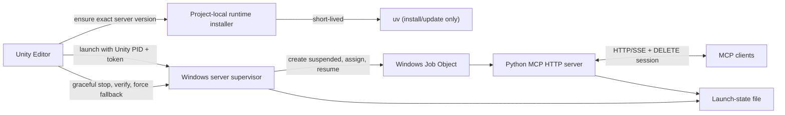

# Server Memory and Lifecycle Hardening Plan

## Goal

Make the local HTTP MCP server:

- bounded when clients create or abandon many HTTP sessions;
- owned by the Unity Editor lifecycle on Windows;
- free of long-lived `uv`/`uvx` launcher overhead;
- observable enough to distinguish a Python allocation leak, retained MCP
  sessions, and Unity-side memory growth;
- reliably gone, with its listening port released, after Unity exits or the
  user presses Stop.

This plan treats the current `ManageAsset` search hardening as a separate,
already-ported safety fix. It does not use a memory limit to hide an unbounded
session-retention defect.

## Implementation Status (2026-07-29)

The lifecycle hardening phases are implemented in this fork:

- the `ManageAsset` search patch has focused regression coverage;
- local HTTP uses bounded idle sessions and maximum admission;
- the server owns an explicit Uvicorn runtime and authenticated loopback
  status/shutdown endpoints;
- Unity installs a version/source-keyed project runtime and `uv` exits before
  steady state;
- Windows runtimes use uv-managed Python so Microsoft Store redirectors cannot
  escape the Job Object;
- Windows uses a Job Object, while macOS/Linux uses a supervised POSIX process
  group with recursive RSS accounting and signal-driven tree shutdown;
- the hard ceiling is enabled by default at 768 MiB (and remains configurable
  or disableable), with a 512 MiB warning threshold;
- local HTTP defaults to a five-minute idle timeout and 16 concurrent sessions;
- hosted HTTP requires API-key validation plus explicit Host/Origin policy,
  and the legacy tool-registration route is unavailable remotely;
- API-key and custom-tool registries are hashed, bounded, owner-scoped, and
  cleaned up on session exit;
- launch ownership is project-scoped, so one Unity project cannot stop or
  inherit another project's managed server;
- normal shutdown is graceful and verified, with forced tree termination only
  as fallback;
- Advanced Settings exposes session and memory limits plus live/last-run
  lifecycle status and a managed-tree stop action.

The separate profiling program below is deferred at the user's request. The
compatibility adapter should eventually be removed after FastMCP exposes the
MCP SDK idle-timeout/session-lifecycle controls directly. Long-duration memory
plateau calibration, 25-cycle editor shutdown testing, and Unity domain-reload
acceptance remain release-validation gates rather than missing implementation.

## Implementation Validation (2026-07-29)

- Python server and tooling suite: 1,472 passed, 5 platform-skipped.
- Unity 2021.3.45f2 native EditMode suite: 1,119 passed, 0 failed, 76 ignored.
- Generated Unity solution: 0 compile errors; seven existing Unity assembly
  reference-version warnings.
- Python source distribution and wheel build successfully as version
  `10.1.1b2`; the wheel contains the `mcp-for-unity`,
  `mcp-for-unity-supervisor`, and `unity-mcp` console entry points.
- The version updater is idempotent, the `uv` lock is current, all GitHub
  workflow YAML files parse, and the website production dependency audit
  reports zero vulnerabilities.

## Current Evidence

The July 2026 Zornhau capture showed:

- approximately 306 MiB of committed private memory in the live local-server
  process tree;
- approximately 209 MiB belonged to the long-lived `uv` process;
- approximately 86 MiB belonged to the Python server;
- 24 HTTP sessions were created, eight were explicitly deleted, and 16
  remained retained;
- an orphan could survive Unity shutdown while retaining its HTTP/SSE
  connections;
- the Windows stop path considered `taskkill /PID <pid> /T` successful when
  the command exited successfully, without subsequently proving that the
  server PID had exited or that the port was released.

The evidence bundle is in the Zornhau workspace at:

`C:\Users\fromanan\Dev\Unity\Zornhau\.ai\outputs\unity-mcp-orphan-profile-2026-07-27`

## Changes Already Ported

`MCPForUnity/Editor/Tools/ManageAsset.cs` now carries the Zornhau search
safety patch:

- collect and count matching paths before hydrating results;
- hydrate only the requested page;
- avoid `AssetDatabase.LoadAssetAtPath` for metadata-only searches;
- cap ordinary result pages at 100 and preview pages at 10;
- support snake_case and camelCase parameter names;
- reject an invalid folder scope instead of falling back to the whole project.

The fork's other apparent differences from the embedded Zornhau package were
only package-version metadata and line-ending changes, so they were
deliberately not copied.

## Recommended Target Architecture

Do not make the current `uvx -> uv -> shim -> Python` tree permanent and then
try to compensate with a large hard cap. Use `uv` only as an installer and run
the installed server directly.

### Why a supervisor

A Windows Job Object is the correct primitive for process-tree containment:
descendants inherit job membership, a job-wide committed-memory limit can be
applied, and `JOB_OBJECT_LIMIT_KILL_ON_JOB_CLOSE` terminates all members when
the owning handle closes.

The Job Object handle should not be owned by a Unity managed object. Unity
domain reload can finalize such an object and accidentally kill a healthy
server, or lose the handle and weaken later cleanup. A small, directly
launched supervisor has a stable OS lifetime:

1. it creates the Job Object;
2. it creates the server suspended;
3. it assigns the server to the job before any descendants can start;
4. it resumes the server;
5. it monitors both the Unity PID and the server PID;
6. it closes the job if Unity disappears, killing the complete server tree.

The Windows supervisor can be a minimal Python entry point installed into the
same project-local virtual environment. It imports only the standard library
and `ctypes`; it does not import the MCP server. That is still much smaller
than keeping the current `uv` resolver/runtime process alive.

## Required Invariants

1. `uv` is not an ancestor of the steady-state server.
2. The server is assigned to its Job Object before it executes user code.
3. A normal stop is graceful first, verified second, and forced only as a
   fallback.
4. PID files and launch tracking are not deleted until the PID is gone and the
   port is no longer listening.
5. A failure to stop preserves enough launch state for a later retry and emits
   an actionable error.
6. HTTP sessions have both explicit client cleanup and a server-side idle
   bound.
7. The default hard memory cap is a configurable circuit breaker, not a
   substitute for bounded sessions and owner-scoped cleanup.
8. Memory-limit termination produces a recognizable exit reason rather than
   looking like an unexplained crash.

## Phase 1: Finish the ManageAsset Port

### Code

- Keep the already-ported
  `MCPForUnity/Editor/Tools/ManageAsset.cs` change.
- Add
  `TestProjects/UnityMCPTests/Assets/Tests/EditMode/Tools/ManageAssetSearchTests.cs`.

### Tests

Use disposable test assets under `Assets/Temp/McpManageAssetTests` and cover:

- invalid folder rejection;
- snake_case and camelCase aliases;
- default, ordinary, and preview page-size caps;
- pagination before hydration;
- metadata-only results returning `instanceID: 0`;
- preview searches hydrating at most ten objects;
- stable totals and `hasNextPage` values.

Do not run a broad search against a production Unity project as part of this
test.

## Phase 2: Replace Long-Lived uv With a Project-Local Runtime

### New C# files

`MCPForUnity/Editor/Services/Server/IServerRuntimeInstaller.cs`

- Defines `EnsureInstalledAsync(version, sourceOverride, cancellationToken)`.
- Returns the absolute paths to the installed server and supervisor entry
  points.

`MCPForUnity/Editor/Services/Server/ServerRuntimeInstaller.cs`

- Creates a versioned virtual environment below
  `Library/MCPForUnity/ServerRuntime/<server-version>/`.
- Runs `uv venv` and `uv pip install` only when the desired version/source is
  absent or has changed.
- Writes an atomic `runtime.json` manifest containing the exact package
  version, source URL/path, Python version, and install timestamp.
- Installs into a staging directory and atomically promotes it only after a
  health/version probe succeeds.
- Keeps one previously known-good runtime for rollback.

`MCPForUnity/Editor/Services/Server/InstalledServerRuntime.cs`

- Immutable value object for server executable, supervisor executable,
  manifest, and version.

### Modified C# files

`MCPForUnity/Editor/Services/Server/ServerCommandBuilder.cs`

- Split “install command” from “steady-state launch command.”
- On Windows, build a direct command for
  `mcp-for-unity-supervisor.exe`.
- On macOS/Linux, launch the installed supervisor, which creates a dedicated
  server process group and watches the Unity PID.
- Preserve the current developer source override, but install that source into
  the project-local runtime instead of running it through a permanent `uvx`
  parent.

`MCPForUnity/Editor/Services/ServerManagementService.cs`

- Ensure the desired runtime before launch.
- Do not hold a bare `Process` as the complete lifecycle model.
- Record supervisor PID, server PID, Unity PID, port, token, runtime version,
  and launch timestamp in one atomic launch-state file.

### Python packaging change

`Server/pyproject.toml`

- Add the console script:
  `mcp-for-unity-supervisor = "process_supervisor.main:main"`.

## Phase 3: Add the Windows Process Supervisor and Job Object

### New Python files

`Server/src/process_supervisor/__init__.py`

- Package marker only.

`Server/src/process_supervisor/windows_job.py`

- Typed `ctypes` wrappers for:
  - `CreateJobObjectW`;
  - `SetInformationJobObject`;
  - `AssignProcessToJobObject`;
  - `QueryInformationJobObject`;
  - `TerminateJobObject`;
  - `CreateProcessW`;
  - `ResumeThread`;
  - `WaitForMultipleObjects`;
  - `GetExitCodeProcess`;
  - `CloseHandle`.
- Define only the required Windows structures and constants.
- Apply `JOB_OBJECT_LIMIT_KILL_ON_JOB_CLOSE`.
- Apply `JOB_OBJECT_LIMIT_JOB_MEMORY` only when a hard cap is explicitly
  enabled.
- Create the child with `CREATE_SUSPENDED | CREATE_NO_WINDOW |
  CREATE_UNICODE_ENVIRONMENT`, assign it to the job, and only then resume it.
- Query job accounting and expose assigned-process count, total user/kernel
  time, I/O totals, and peak job memory.

`Server/src/process_supervisor/main.py`

- Parse the Unity PID, port, instance token, state-file path, soft warning
  threshold, optional hard cap, and child command.
- Open a synchronization handle for the Unity process.
- Create the job and server child.
- Atomically publish a launch-state handshake after assignment succeeds.
- Wait for Unity exit, server exit, or a stop signal.
- On Unity exit, close/terminate the job and wait for its members to disappear.
- On server exit, record its exit code and the final job accounting, then exit.
- Emit one-line structured JSON lifecycle events to the normal server launch
  log.

`Server/src/process_supervisor/state.py`

- Versioned launch-state schema and atomic write/read helpers.
- Reject stale state whose Unity PID, instance token, or process creation time
  does not match.

### Tests

`Server/tests/process_supervisor/test_windows_job.py`

- A child and grandchild are both contained.
- Closing the job kills both.
- The child cannot run before assignment.
- The optional hard cap is enforced in a disposable allocator child.
- Accounting reports nonzero process and memory data.

`Server/tests/process_supervisor/test_supervisor_lifecycle.py`

- Exiting a fake parent terminates the server tree.
- Normal server exit lets the supervisor exit without force.
- A stale state file cannot target a reused PID.
- Spaces and Unicode in runtime paths are handled correctly.

Windows-only integration tests should be marked and run in CI on a Windows
worker. Unit tests for state parsing and command construction remain
cross-platform.

## Phase 4: Make Shutdown Graceful and Verifiable

### First corrective change

Modify `MCPForUnity/Editor/Services/Server/ProcessTerminator.cs`:

1. send the current non-forced `taskkill /PID <pid> /T`;
2. poll process identity and port state for up to three seconds;
3. if either remains, issue `taskkill /F /PID <pid> /T`;
4. poll for up to eight seconds;
5. return success only when the original process identity is gone and the
   expected port is released.

Extract command execution, process identity, time, and port probes behind
interfaces so the state machine is deterministic in tests.

Modify `MCPForUnity/Editor/Services/ServerManagementService.cs`:

- retain the PID/token/state files on failed cleanup;
- never equate `taskkill` exit code zero with process exit;
- prefer supervisor PID/tree termination when launch-state ownership is valid;
- treat listener PID termination as a compatibility fallback for servers
  launched by older package versions;
- emit the exact remaining PID, command line, port owner, and next retry action
  when cleanup fails.

Modify
`MCPForUnity/Editor/Services/McpEditorShutdownCleanup.cs`:

- log a warning if the managed server is still present after shutdown cleanup;
- make the final fallback close/terminate the supervisor, which closes the Job
  Object;
- keep the editor-quitting path bounded so it cannot hang Unity indefinitely.

### Authenticated graceful endpoint

Refactor server HTTP ownership rather than reaching into private FastMCP
internals.

`Server/src/http_runtime.py`

- Build the ASGI app and run an explicit `uvicorn.Server`.
- Own a shutdown event and set `server.should_exit` when a validated local
  request asks the server to stop.
- Keep existing FastMCP routes and lifespan behavior intact.

Modify `Server/src/main.py`:

- delegate HTTP execution to `http_runtime.py`;
- register `POST /api/shutdown` only for locally managed mode;
- require loopback origin and the exact `UNITY_MCP_INSTANCE_TOKEN`;
- compare the token with `hmac.compare_digest`;
- return `202 Accepted` before scheduling graceful shutdown;
- do not expose this route for remote-hosted deployments.

Modify `ServerManagementService.cs`:

1. call the authenticated local shutdown endpoint;
2. wait for PID exit and port release;
3. ask/terminate the supervisor if the grace period expires;
4. use the verified `taskkill /F /T` compatibility fallback last.

### Shutdown tests

- Wrong/missing token is rejected.
- Non-loopback requests are rejected.
- A correct request drains and exits.
- An active SSE connection does not leave an orphan.
- Failed graceful shutdown escalates.
- PID/state files survive a failed stop and disappear after verified cleanup.
- Repeated start/stop cycles do not reuse a stale identity.

## Phase 5: Bound HTTP Session Lifetime

Client `DELETE` is necessary but insufficient because a client can crash,
disconnect, or fail to implement cleanup.

### Configuration

Modify `Server/src/core/config.py`:

- `http_session_idle_timeout_seconds`, default 300;
- `http_max_sessions`, default 16;
- `memory_profile_enabled`, default false;
- validation and environment-variable mappings for all three.

Modify `Server/src/main.py`:

- expose matching CLI switches;
- log effective session limits at startup.

### FastMCP integration

The currently used FastMCP HTTP construction does not forward the Python MCP
SDK's `session_idle_timeout` setting. Implement this in two stages:

1. submit an upstream FastMCP change that passes the timeout through its
   Streamable HTTP session-manager construction and public HTTP run/app API;
2. until a released dependency contains it, isolate the smallest compatibility
   adapter in
   `Server/src/transport/bounded_streamable_http.py`.

Do not scatter a monkeypatch through `main.py`.

The adapter must:

- pass the idle timeout into the SDK session manager;
- enforce `http_max_sessions` with a clear retryable response;
- decrement the count on explicit `DELETE`, idle expiration, and failed
  initialization;
- expose lifecycle callbacks for metrics;
- preserve resumption and tool-list-change notification behavior.

### Client follow-up

Every MCP client should send HTTP `DELETE` for its session during a normal task
close. Record a separate client issue if Codex does not do so. Server-side idle
expiration remains mandatory even after the client is fixed.

## Phase 6: Memory Policy and User Settings

### Policy

- Always enable Job Object containment on Windows.
- Default soft warning: 512 MiB committed memory for the server job.
- Default hard cap: 768 MiB.
- The operator may disable or raise it for unusually large controlled
  workloads.
- Recalibrate from representative profiling before changing the default.

A hard Job Object cap makes allocations fail. It is a circuit breaker, not a
garbage collector and not the primary leak fix.

### Unity settings changes

Modify `MCPForUnity/Editor/Constants/EditorPrefKeys.cs`:

- `ServerMemorySoftLimitMb`;
- `ServerMemoryHardLimitEnabled`;
- `ServerMemoryHardLimitMb`;
- `ServerSessionIdleTimeoutSeconds`;
- `ServerMaxSessions`.

Modify the corresponding cache/model in
`MCPForUnity/Editor/Services/EditorConfigurationCache.cs`.

Modify
`MCPForUnity/Editor/Windows/Components/Advanced/McpAdvancedSection.cs`
and its UXML, if applicable:

- show current server job memory, peak memory, process count, and active HTTP
  sessions;
- expose the soft warning and opt-in hard cap;
- explain that the hard cap can terminate memory-intensive requests;
- add “Export server diagnostics” and “Stop server tree” actions.

### Runtime reaction

- The supervisor samples job/process memory every five seconds.
- Crossing the soft limit writes a structured warning and asks the server for a
  lightweight diagnostic snapshot.
- Crossing a hard limit is handled by Windows; on the next launch the UI reads
  the supervisor's final state and reports “memory limit exceeded” explicitly.
- Do not automatically restart in a loop after a memory-limit exit.

## Separate Profiling Program

Profiling must answer four different questions:

1. Does memory grow when reusing one MCP session?
2. Does it grow only as new sessions are retained?
3. Does memory return after explicit `DELETE`, idle timeout, and `gc.collect()`?
4. Is the large growth in the Python server, the launcher, or the Unity Editor?

### Script 1: Process-tree telemetry

Create `scripts/profile-mcp-process-tree.ps1`.

Inputs:

- port or launch-state file;
- sample interval;
- duration/output directory;
- optional VMMap and ProcDump locations.

At each sample, append CSV and NDJSON records for every related PID:

- PID, parent PID, creation time, executable, and command line;
- private bytes, working set, virtual bytes, paged bytes;
- CPU time, handle count, thread count;
- TCP connection count and states;
- listener ownership;
- server-log session-created, deleted, expired, and active counters.

The script must copy relevant launch/server logs, calculate hashes, capture
package/runtime versions, and write a final Markdown summary. It must never
terminate a process unless an explicit `-TerminateAtEnd` switch is supplied.

### Script 2: Repeatable session/request workload

Create `scripts/stress-http-sessions.py`.

Scenarios:

- one session reused for 1,000 requests;
- 100 sessions created and explicitly deleted;
- 100 sessions created and abandoned;
- Codex-like long-lived GET/SSE connections opened and closed;
- idle-timeout wait and reinitialization after the expected `404`;
- request mixes for `tools/list`, cheap tools, and a controlled Unity fixture
  tool.

Record per-iteration latency, response code, session ID, session action, and
server metrics. Use a seed and emit machine-readable JSON/CSV so before/after
builds can be compared.

### Script 3: Python allocation snapshots

Create `Server/src/diagnostics/memory_profile.py`.

When `UNITY_MCP_PROFILE_MEMORY=1`:

- start `tracemalloc` before importing the MCP application;
- capture snapshots at startup, after every configurable number of session
  creates, after deletes/expirations, and after forced GC checkpoints;
- write `Snapshot.compare_to()` top allocation stacks as JSON and text;
- record `gc.get_stats()`, object counts for known session/transport types,
  active tasks, and active-session metrics;
- provide a token-protected, loopback-only
  `POST /api/debug/memory-snapshot` endpoint in managed local mode.

Keep profiling off by default because allocation tracing changes performance
and memory use.

### Script 4: Windows native captures

Create `scripts/capture-windows-memory.ps1`.

- Export VMMap snapshots for the supervisor and server.
- Optionally collect ProcDump full dumps at configured private-byte thresholds.
- Optionally configure and run WPR heap tracing/snapshots for the exact
  executable.
- Restore WPR/heap-tracing configuration in a `finally` block.
- Write every command, exit code, PID identity, and output artifact into a
  manifest.

Use WPR heap tracing only in a controlled reproduction because it has
significant overhead.

### Unity-side profiling

Use the Unity Memory Profiler in a disposable or copied project:

1. snapshot after editor stabilization;
2. run a fixed MCP request workload;
3. snapshot after the workload;
4. explicitly close/delete sessions and wait for idle cleanup;
5. force a controlled unload/GC and take a final snapshot;
6. compare managed, native, graphics, texture, and Unity object counts.

For `ManageAsset`, compare the same narrow fixture search on the unpatched and
patched implementations. Never reproduce the historical broad texture search
against the full Zornhau asset set.

## Acceptance Gates

### Memory and sessions

- One session reused for 1,000 cheap requests keeps active sessions at one and
  reaches a memory plateau.
- After 100 create/delete cycles, active sessions return to zero.
- After 100 abandoned sessions, active sessions return to zero after the idle
  timeout.
- A 30-minute steady-state run does not show a statistically meaningful
  positive private-byte slope after warm-up.

### Shutdown

- Closing Unity with active SSE connections leaves no matching supervisor,
  server, or listener within ten seconds.
- Twenty-five start/stop cycles produce zero orphan processes and zero stale
  launch-state files.
- Killing Unity abruptly still closes the Job Object and removes the server
  tree.
- A failed graceful request escalates and produces a diagnostic reason.

### Runtime and limits

- `uv` is absent from the steady-state ancestor/descendant tree.
- Domain reload neither kills nor loses ownership of the supervisor.
- The optional hard-limit fixture terminates with a recognizable memory-limit
  status.
- With the hard limit disabled, representative asset-preview and tool workloads
  complete without a new artificial ceiling.

## Suggested Pull Request Sequence

1. **ManageAsset search hardening and tests** — the source fix is already
   ported.
2. **Verified Windows shutdown** — correct `ProcessTerminator` and tracking
   semantics before larger launch changes.
3. **Project-local runtime and Windows supervisor** — remove long-lived `uv`,
   add Job Object containment, and preserve compatibility cleanup.
4. **Graceful local shutdown endpoint** — explicit Uvicorn ownership and
   authenticated drain.
5. **Session bounds and metrics** — upstream FastMCP pass-through plus the
   temporary isolated adapter.
6. **Profiling harness and advanced UI** — repeatable workloads, exports,
   thresholds, and operator-visible diagnostics.
7. **Default-policy calibration** — choose any default hard cap only after the
   acceptance workloads have produced a safe distribution.

Each pull request should contain its own Windows start/stop integration test
and should be tested across a Unity domain reload before merge.

## Primary References

- [Windows Job Objects](https://learn.microsoft.com/en-us/windows/win32/procthread/job-objects)
- [Job Object limit flags](https://learn.microsoft.com/en-us/windows/win32/api/winnt/ns-winnt-jobobject_basic_limit_information)
- [Windows process-creation flags](https://learn.microsoft.com/en-us/windows/win32/procthread/process-creation-flags)
- [MCP Streamable HTTP session management](https://modelcontextprotocol.io/specification/2025-03-26/basic/transports#session-management)
- [Python `tracemalloc`](https://docs.python.org/3/library/tracemalloc.html)
- [Windows Performance Recorder heap analysis](https://learn.microsoft.com/en-us/windows-hardware/test/wpt/recording-for-heap-analysis)
- [VMMap](https://learn.microsoft.com/en-us/sysinternals/downloads/vmmap)
- [ProcDump](https://learn.microsoft.com/en-us/sysinternals/downloads/procdump)
